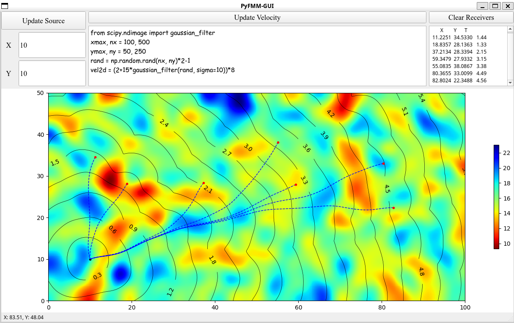

基于PyQt5开发的简易图形界面，用于计算任意速度场下的二维全局走时场。计算模块基于[***PyFMM***](https://github.com/Dengda98/PyFMM)。  

该GUI本质算是个教学小工具，图像可帮助初学者更好的理解射线追踪，也可更方便、直观地看到不同速度场下射线的扭曲形态。




## 安装

1、安装[***PyFMM***](https://github.com/Dengda98/PyFMM).

2、安装PyQt5
```bash 
    conda install pyqt -c conda-forge
```

3、安装本程序    
有两个选择：
+ **不提前下载程序包**  

  要求你当前环境中有git工具。这样可直接运行
  ```bash
  # vx.x.x指代Release中的版本号，建议下载最新稳定版本
  pip install -v git+https://github.com/Dengda98/PyFMM-GUI@vx.x.x
  ```


+ **提前下载好程序包** 

  **建议在[Release](https://github.com/Dengda98/PyFMM-GUI/releases)中下载最新稳定版本**，不推荐clone，不推荐直接下载主分支。在下载解压后，在程序根目录下运行
  ```bash
  pip install -v .
  ``` 

这样可安装到你的虚拟环境中。 


## 使用

```bash 
    python -m pyfmm-gui.main
```  

功能按钮很简单，基本“所见即所得”。其中`Update Velocity`下的文本框是个Python脚本窗口，可以自定义FMM网格范围(`xmax, ymax`，最小值均为0)、划分数(`nx, ny`)，以及2D速度数组`vel2d`。设置好后，点击`Update Velocity`即可计算。